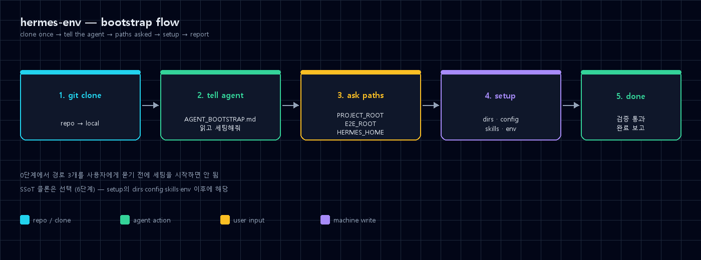
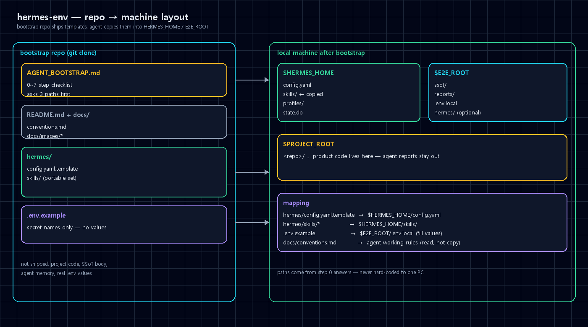

# hermes-env

어떤 PC든 `git clone` 한 번. 에이전트에게 `AGENT_BOOTSTRAP.md` 읽고 세팅하라고 하면 끝.

Hermes 에이전트 작업 환경(디렉토리 구조, 스킬, config, 워크플로우 규칙)을 그대로 옮기는 bootstrap repo다.
프로젝트 코드·SSoT 본문·메모리·시크릿 값은 안 넣는다.



## Quick Start

```bash
git clone <이 레포 URL> hermes-env
cd hermes-env
```

Hermes 에이전트에게:

> `AGENT_BOOTSTRAP.md`를 읽고 순서대로 세팅해줘.

에이전트가 0단계에서 경로 3개를 묻는다. 답하면 그 값 기준으로 나머지를 깐다.

| # | 질문 | 변수 |
|---|------|------|
| 1 | 프로젝트 코드가 모일 루트 | `PROJECT_ROOT` |
| 2 | ssot / reports 등 E2E 루트 | `E2E_ROOT` |
| 3 | Hermes 설치 경로 (기본 `$HOME/.hermes`) | `HERMES_HOME` |

이 질문 없이 세팅을 시작하면 안 된다.

## 한눈에



## 구조

```
├── AGENT_BOOTSTRAP.md          # 에이전트가 따라하는 0~7단계 체크리스트
├── README.md
├── .env.example                # 시크릿 이름만 (값 없음)
├── hermes/
│   ├── config.yaml.template    # default 워커 (워크플로우 전용, 모델/프로바이더 제외)
│   ├── profiles/
│   │   ├── pm/                 # PM(프로젝트 매니저) — SOUL + kanban 템플릿
│   │   ├── dev/                # Dev(개발 리드) — SOUL + config 템플릿
│   │   ├── infra/              # Infra(인프라) — SOUL + config 템플릿
│   │   ├── qa/                 # QA(검수) — SOUL + config 템플릿(토론 규칙 포함)
│   │   └── ops/                # Ops(비서/디스패처) — SOUL + kanban 템플릿
│   └── skills/                 # 이식용 스킬 (경로 정규화됨)
└── docs/
    ├── conventions.md          # 디렉토리 / 워크플로우 규칙
    ├── kanban-fleet.md         # 5인조 멀티에이전트 dispatch / assignee
    ├── workflow-cungya.md      # 역할별 페르소나 5인조 워크플로우
    └── images/
        ├── flow.png
        └── architecture.png
```

## 포함 / 미포함

| 포함 | 미포함 |
|------|--------|
| 부트스트랩 체크리스트 | 프로젝트 코드 |
| config 워크플로우 템플릿(kanban/discord/SOUL 등) | 모델명·프로바이더·API키 |
| 이식용 스킬 세트 | 에이전트 메모리 |
| 컨벤션 문서 | `.env` 실제 값 |
| 플로우 / 배치 다이어그램 | 특정 PC 하드코딩 경로 |

## 포함 스킬 (요약)

- `hermes-agent` — Hermes 설정·확장
- `ponytail` 계열 — 최소 구현 / 과설계 리뷰
- `e2e-workspace` — E2E 레이아웃 컨벤션
- `code-flow-audit` — 엔트리→스토어 추적
- `hermes-credential-discovery` — 자격증명 탐색
- `kanban-worker` / `kanban-orchestrator`
- `ocr-and-documents`
- GitHub 워크플로 스킬 묶음 (auth, issues, PR, review, repo, inspection)

## 대상

- Hermes Agent를 새 머신에 다시 깔 사람
- 팀 온보딩 (같은 디렉토리·스킬·규칙으로 맞추고 싶을 때)

## 다음 문서

1. [`AGENT_BOOTSTRAP.md`](AGENT_BOOTSTRAP.md) — 실제 세팅 순서
2. [`docs/conventions.md`](docs/conventions.md) — 디렉토리 분리·산출물 규칙
3. [`docs/kanban-fleet.md`](docs/kanban-fleet.md) — 양송 Kanban dispatch / assignee
4. [`docs/workflow-cungya.md`](docs/workflow-cungya.md) — 역할별 페르소나 5인조 워크플로우 (대장님 멀티에이전트)
